# ALGOPOLIS — *Your algorithms govern the city*

> A browser‑native **3D strategy simulation** that teaches **computational thinking** and **AI ethics** by letting you *be* the algorithm that runs a city.

[](https://ancient-pebble-944.higgsfield.gg/)
[](https://threejs.org/)
[](#-architecture)
[](LICENSE)

### ▶ Play: **https://ancient-pebble-944.higgsfield.gg/**

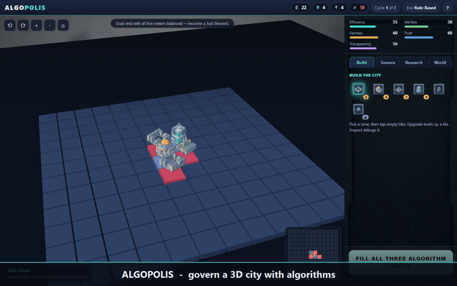

*(Full narrated walkthrough: [`docs/walkthrough.mp4`](docs/walkthrough.mp4))*

---

## What is it?

In **ALGOPOLIS** you don't move units — you **design the policy algorithm** that governs a city, then watch it play out across a living 3D map. Each cycle you **BUILD** districts, **RESEARCH** new capabilities, and **GOVERN** by assembling one algorithm from blocks:

> **read DATA (INPUT) → decide with a RULE (LOGIC) → take an ACTION**

Run it across the whole map and five meters respond — **efficiency, welfare, fairness, trust, transparency**. The twist is the lesson: greedy rules on **biased data** quietly **starve whole districts** and entrench a **feedback loop**. You debug it, research fairer and more *explainable* AI, survive ethical dilemmas, and try to leave a **balanced legacy** — not just a high efficiency score.

It is built for **classroom and workshop use** (AI literacy, CS education, ethics), but plays as a real game.

---

## Screenshots

<table>
  <tr>
    <td>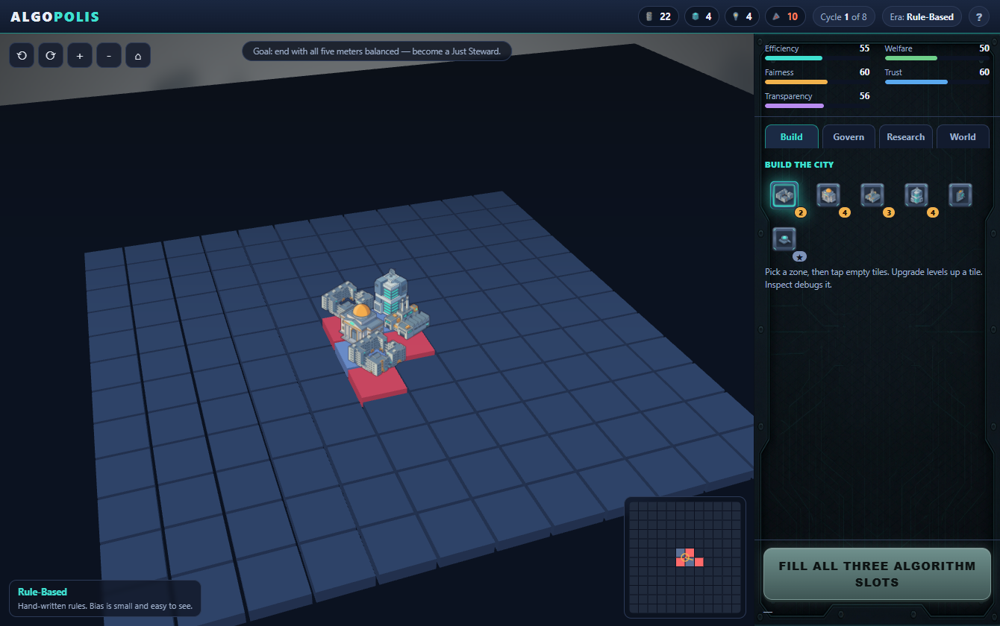<br><sub>Real‑time 3D isometric city (orbit · tilt · zoom)</sub></td>
    <td>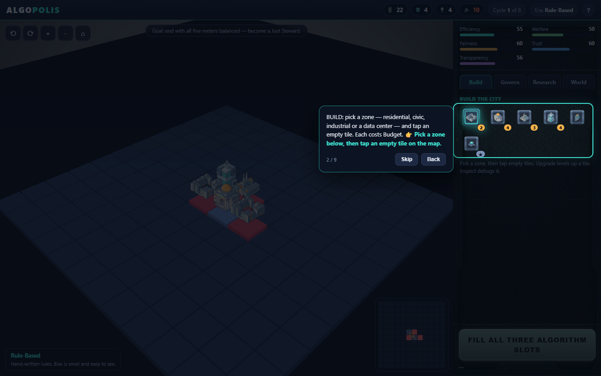<br><sub>Hands‑on spotlight tutorial</sub></td>
  </tr>
  <tr>
    <td>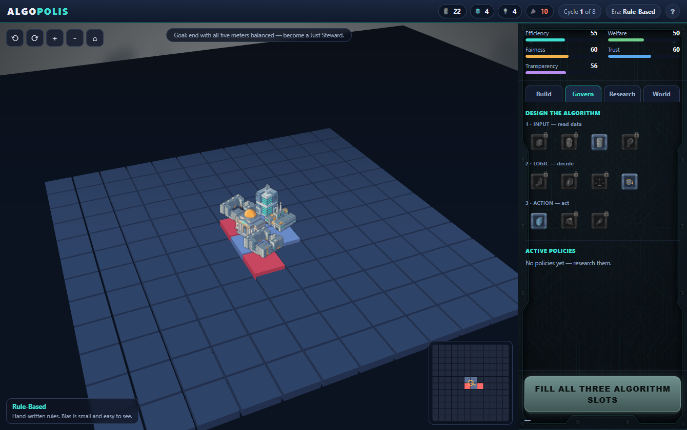<br><sub>GOVERN — assemble an INPUT→LOGIC→ACTION algorithm</sub></td>
    <td>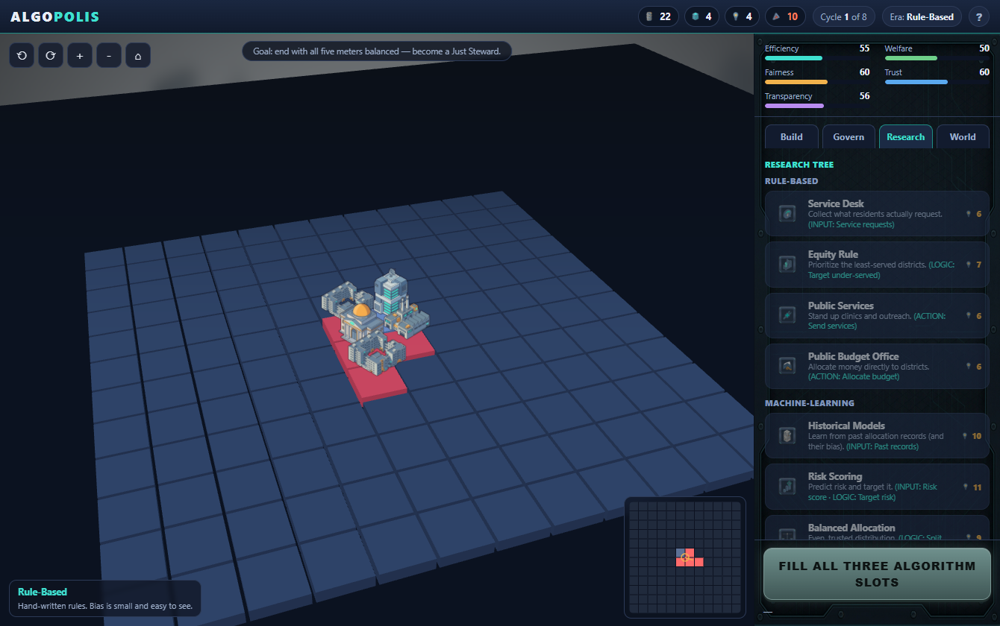<br><sub>RESEARCH — a tech tree toward explainable AI</sub></td>
  </tr>
  <tr>
    <td>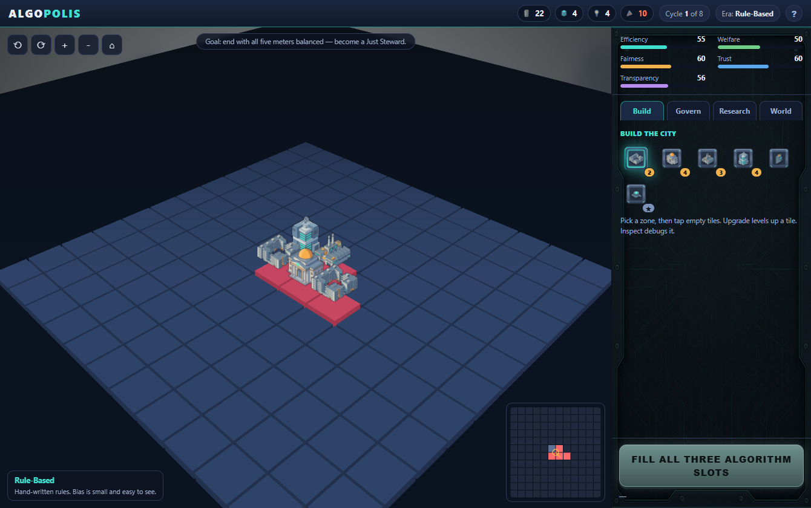<br><sub>DEBUG a tile — trace the bias feedback loop</sub></td>
    <td>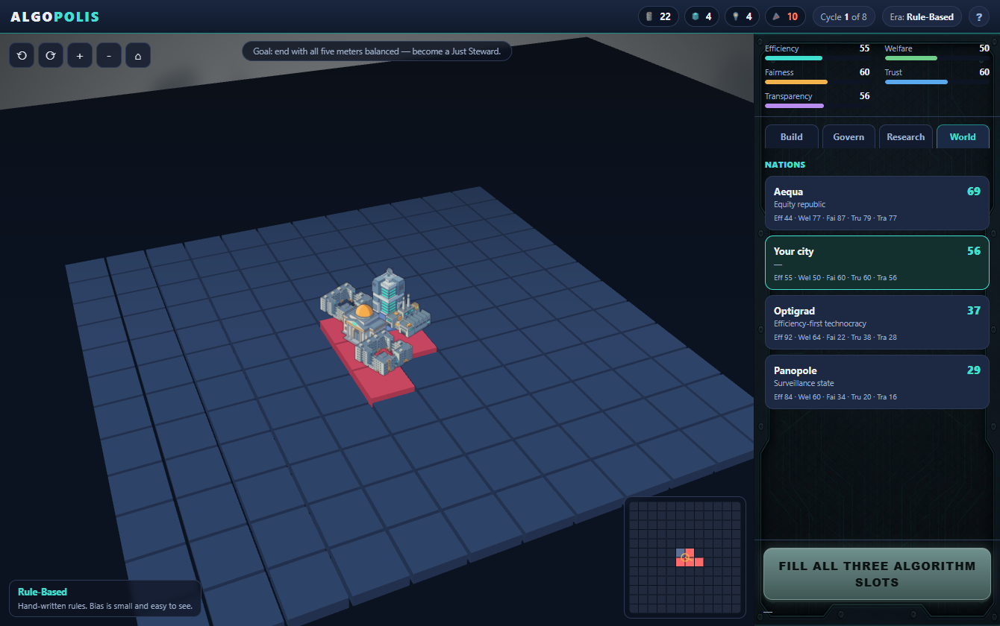<br><sub>WORLD — compete with rival AI nations</sub></td>
  </tr>
  <tr>
    <td>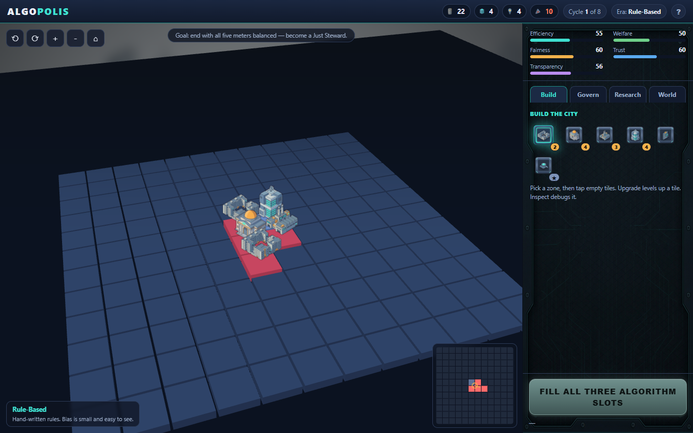<br><sub>BUILD — zones, data centers, upgrades</sub></td>
    <td>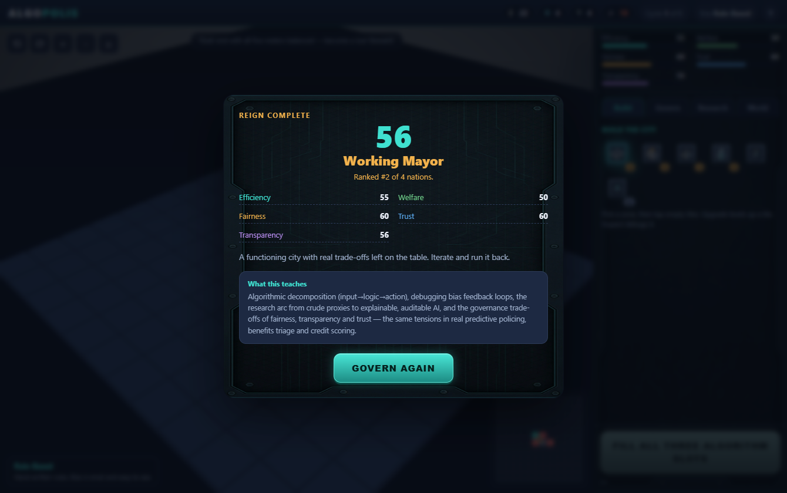<br><sub>Outcome — victory path + concepts recap</sub></td>
  </tr>
</table>

---

## Features

- 🧊 **True 3D** isometric city (Three.js / WebGL): free orbit, tilt, zoom, 4‑angle snap, raised tiles, living buildings, fog depth.
- 🧩 **Algorithm builder** — compose one policy from INPUT / LOGIC / ACTION blocks; debug any tile to see *why* it decided.
- 🔬 **Tech tree** — spend **Insight** to advance from crude proxies and cost‑cutting toward **federated data, explainability, and algorithmic audit**.
- 🏙️ **City management** — four resources (Budget · Data · Insight · Unrest), tile levels, district adjacency.
- ⚖️ **AI‑ethics engine** — a real **bias feedback loop**: biased data starves districts and worsens their own future data.
- 🌍 **Geopolitics** — rival AI nations evolve and compete on a live leaderboard.
- 🎲 **Replayability** — event deck of ethical dilemmas, randomized maps, multiple victory paths + a collapse failure state.
- 🎓 **Pedagogy built‑in** — hands‑on tutorial, per‑cycle coaching debriefs, and an end‑screen **concept recap**.
- 🌐 **Bilingual** — English / 한국어, one‑tap toggle (or `?lang=ko`); all text externalized for easy translation.
- 📦 **Zero backend** — a single static page; runs offline once loaded.

---

## How it teaches

ALGOPOLIS turns abstract ideas into **mechanics you must operate**:

| In‑game action | What it makes concrete |
|---|---|
| Assembling INPUT→LOGIC→ACTION | **Decomposition** & **algorithm design** |
| Reading districts as data vs. real need | **Abstraction** & data‑vs‑reality gaps |
| Spotting red‑glowing starved tiles | **Pattern recognition** |
| Tapping a tile to trace its result | **Debugging / evaluation** |
| Watching fairness fall as efficiency rises | The **fairness ↔ efficiency trade‑off** |
| Data drifting below real need each cycle | **Bias feedback loops** (proxy & historical bias) |
| Researching Explainability & Audit | **Transparency & accountability** |

### 🧠 The core lesson — the bias feedback loop

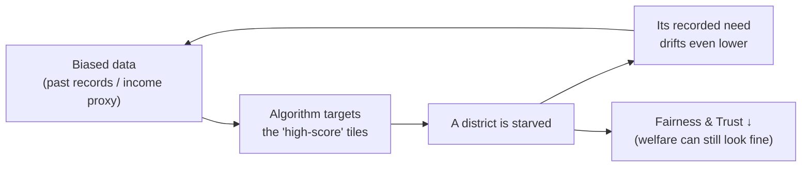

### Competency mapping

Mechanics mapped to widely‑used frameworks — **Computational Thinking** (Wing; CSTA K‑12 CS Standards), **AI literacy** (Long & Magerko, 2020), and **AI ethics principles** (OECD / UNESCO).

| Competency | Framework anchor | Where it lives in the game | Evidence the game can capture |
|---|---|---|---|
| Decomposition | CT · CSTA `3A‑AP‑13` | Splitting policy into INPUT / LOGIC / ACTION | Completing a valid 3‑block algorithm |
| Abstraction | CT · CSTA `3B‑AP‑11` | Districts represented as need vs. recorded data | Choosing INPUT sources |
| Pattern recognition | CT | Reading meters & red starved tiles on the map/minimap | Reacting to coverage spread |
| Algorithm design & control | CT · CSTA `3A‑AP‑17` | Choosing LOGIC (target‑risk / under‑served / equal / cost) | Per‑cycle algorithm + outcomes |
| Debugging & evaluation | CT · CSTA `3A‑AP‑21` | Tile **DEBUG** trace (real need vs data vs served) | Opening debug; correcting the loop |
| Recognize AI & data role | AI literacy (L&M #1,5) | Algorithm reads data → acts on the city | INPUT/LOGIC choices |
| Bias & fairness | AI ethics · AI literacy (#9) | Bias feedback loop; fairness meter | Fairness trajectory, starved‑district count |
| Transparency / explainability | OECD AI principle | Explainability policy; "publish the algorithm" dilemma | Transparency meter; dilemma choices |
| Accountability / oversight | OECD/UNESCO | Algorithmic Audit policy; "automation bias" event | Policies researched; event choices |
| Trade‑off & consequence reasoning | AI ethics | 5‑meter balance; victory = balanced legacy | Final harmonic legacy + victory path |

> The end screen surfaces a **"Concepts you explored"** list, making the session debriefable for a teacher or facilitator.

---

## 🏗 Architecture

A deliberately small, **single‑page, no‑backend** game. Simulation, rendering and UI are all client‑side; the only "server" is a static CDN.

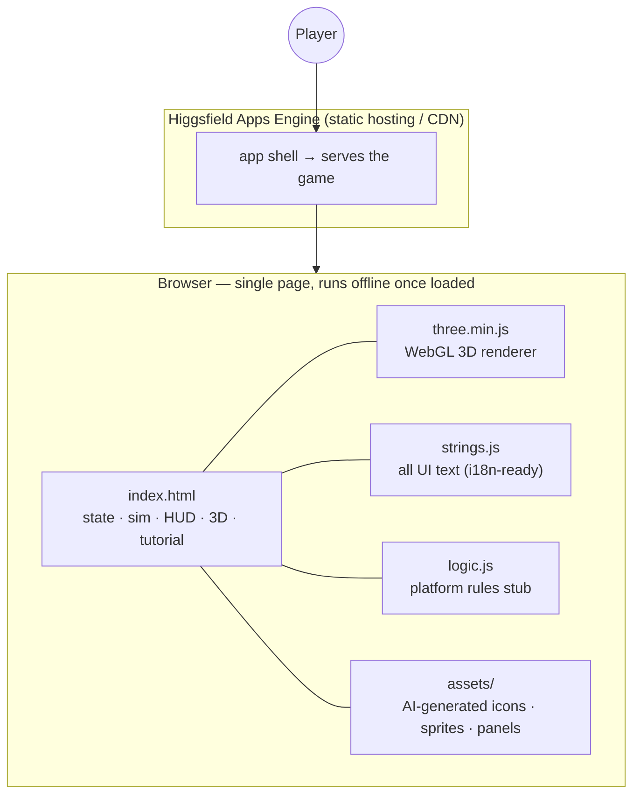

### Turn / game loop

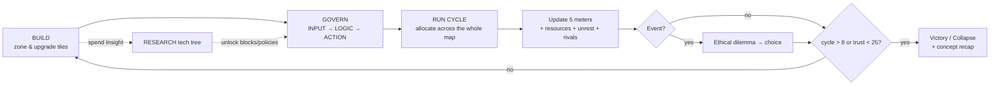

### Rendering model
The map is a Three.js scene: each tile is a `BoxGeometry` mesh (coloured by coverage), each building is an **upright billboard `Sprite`** textured from the AI‑generated art (preserves the 2D art style while the camera orbits in true 3D). A custom spherical‑coordinate orbit camera (lerped) handles rotate/tilt/zoom; a raycaster does tile picking for build/inspect/upgrade. The HUD, tutorial spotlight, tech tree and modals are plain DOM over the canvas.

---

## Tech stack

- **Vanilla JS** (ES modules) — no framework, no build step.
- **Three.js r128** (vendored, `assets/three.min.js`) — WebGL 3D.
- **Canvas 2D** — minimap.
- **Deterministic seeded RNG** (mulberry32) — reproducible runs.
- **AI‑generated art** (Higgsfield) — icons, building sprites, UI panels, with runtime magenta chroma‑keying.
- **Static hosting** on the Higgsfield Apps engine.

## Project structure

```
algopolis/
├── index.html         # game: state, simulation, 3D render, HUD, tutorial
├── strings.js         # all player-facing text (i18n-ready)
├── logic.js           # platform rules stub (single-player)
├── assets/            # icons, building sprites, UI panels, three.min.js
└── docs/
    ├── walkthrough.mp4 # narrated walkthrough
    ├── walkthrough.gif # preview
    └── screenshots/
```

## Run locally

ES modules need a server (not `file://`):

```bash
cd algopolis
python -m http.server 8000
# open http://localhost:8000
```

Helper query flags: `?nointro` skip intro · `?tour` start tutorial · `?dev` FPS overlay.

---

## Game suite & research telemetry

ALGOPOLIS (the *designer* lens on algorithmic systems) is designed to pair with **Reboot 2050** (a *citizen/decision* lens on AI ethics) as a complementary two‑game suite for AI‑literacy education and research. Both map to the same competency framework but cover different stances and cognitive levels.

A draft plan for **analysis‑compatible learning telemetry** across the two games — using a shared participant id and a mirrored log schema, while keeping each game's data store fully isolated — lives in **[`docs/TELEMETRY_PLAN.md`](docs/TELEMETRY_PLAN.md)**. (Plan only; not yet implemented.)

## Credits

Designed & built by **Jewoong Moon** as part of an evidence‑grounded educational‑games line on AI literacy and ethics. Art generated with Higgsfield; 3D via Three.js (MIT).

## License

[MIT](LICENSE) for the code. See the file for details.
